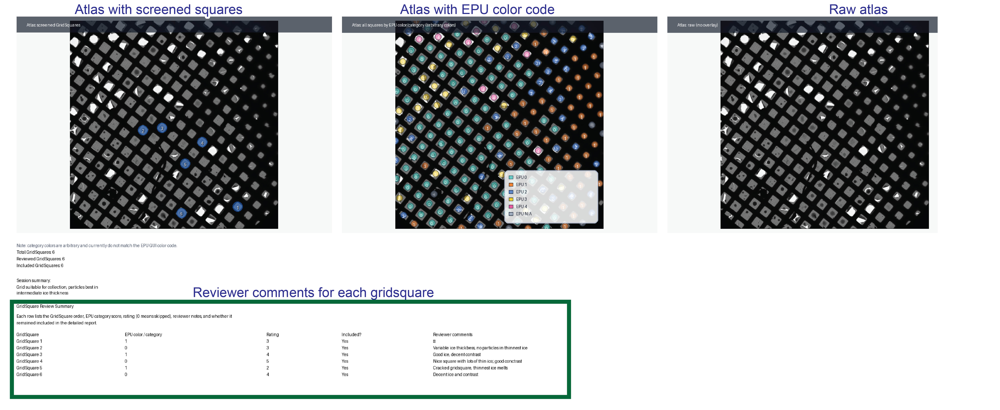
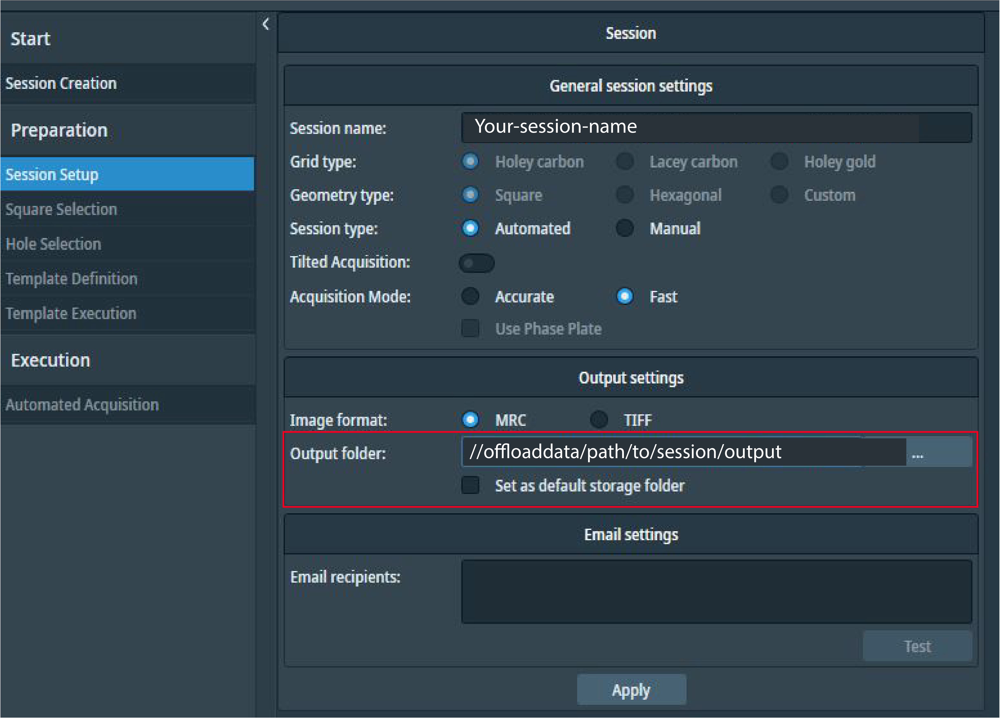
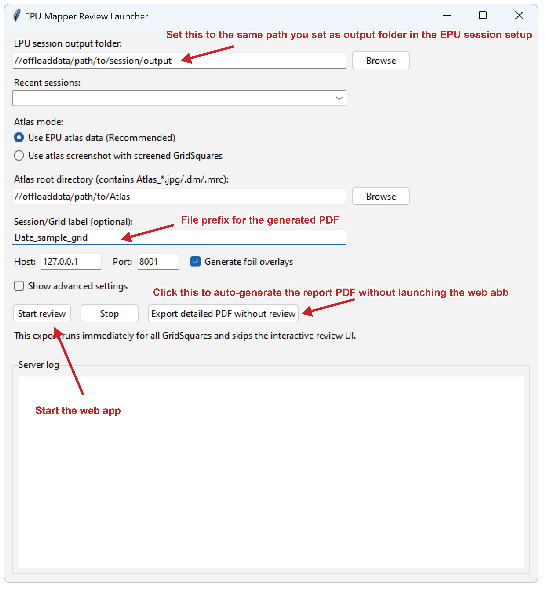
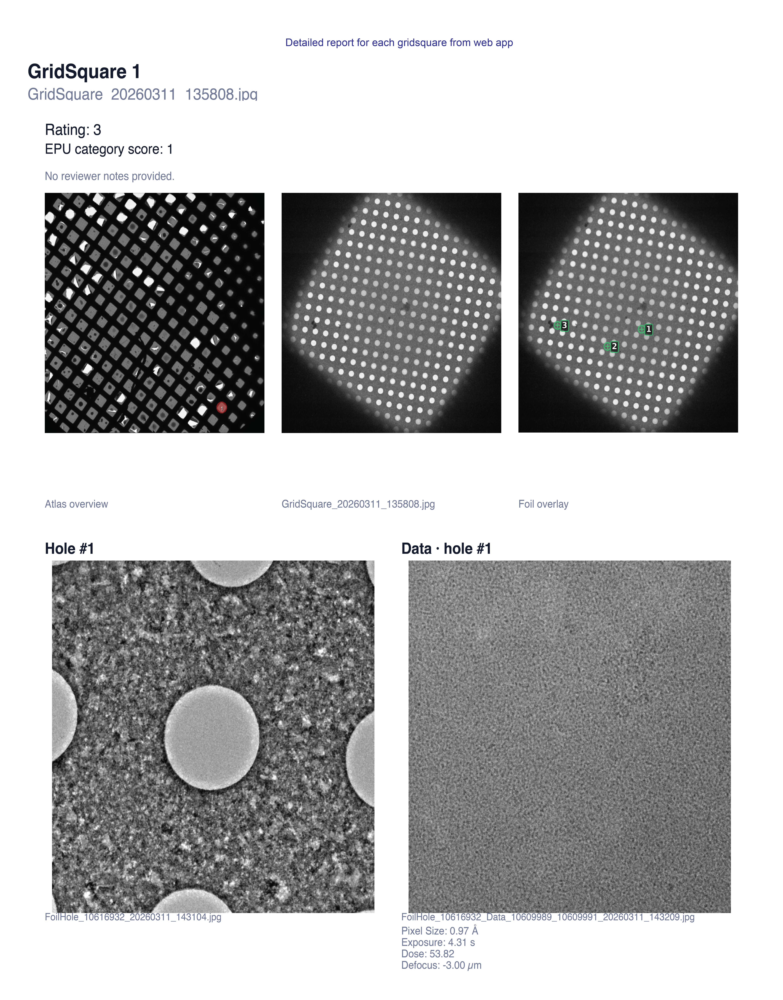

# EPU Screening Review App

The EPU Mapper web app speeds up review of Thermo Fisher EPU screening sessions so you can quickly decide which GridSquares (and FoilHoles inside them) are worth following up. It renders every square, lets you add per-square ratings/comments, and exports PDF reports.

## Why use it
- Inspect GridSquare, FoilHole, and Data images in one page.
- Map the acquired FoilHoles onto the GridSquare and the current GridSquare
  position on the atlas to pick the best areas.
- Switch between JPEG and MRC, adjust contrast, zoom, and pan inside the main
  viewer.
- Rate each GridSquare, add reviewer comments, and choose whether it stays in
  the final report.


### Export summaries to guide your data collection set-up

The app generates a PDF with a high-level summary and detailed per-grid-square
images. The overview is useful to quickly decide on the best squares when
setting up your high-res data collection:



- The combined PDF starts with atlas overviews, EPU category overview, session
  summary, and the review table with ratings and comments.
- Detailed pages then show each selected GridSquare in context, including atlas
  location, foil overlay, matched FoilHole/Data images, and acquisition
  metadata.

## Installation

### Windows installer

1. Download the latest `EPUMapperReviewInstaller_<version>.exe` from the
   [Releases page](https://github.com/mvorlander/EPU_mapper/releases).
2. Double-click the installer and accept the defaults (the installer bundles
   Python, so no extra dependencies are needed).
3. Launch **EPU Mapper Review** from the Start Menu shortcut.


### Install in conda env (for macOS or Linux)

Use the provided `environment.yml` to create a reproducible Conda environment.

**Installation**

```bash
conda env create -f environment.yml          # first time only
conda activate epu-mapper
# pull in dependency updates later with: conda env update -f environment.yml
```

**Usage**

```bash
./scripts/run_review_app.sh //offloaddata/path/to/session/output --atlas /path/to/Atlas --host 127.0.0.1 --port 8000 --open
```

This uses the same recommended inputs as the GUI: the EPU session output folder
for the main path, and the Atlas directory for `--atlas`.


## Step-by-step walkthrough

### 1. Find the EPU output folder



Use the same folder shown as `Output folder` in the EPU session setup. This is the path you should paste into the app as the `EPU session output folder`, and it should contain one or more `Images-Disc*` folders with a structure like this:

```
Images-Disc1/
├── GridSquare_19828383/
│   ├── GridSquare_20260220_132420.jpg
│   ├── FoilHoles/FoilHole_19919351_20260220_132420.jpg (+ .xml)
│   └── Data/FoilHole_19919351_Data_20260220_132420.jpg (+ .xml)
├── Metadata/
│   └── GridSquare_19828383.dm
├── EpuSession.dm
└── review_responses.json / PDFs   # written by the app
```


### 2. Start the launcher and fill the launcher fields



- `EPU session output folder:` use the EPU `Output folder` path shown above.
- `Use EPU atlas data (Recommended):` point this to the `Atlas/` folder that EPU created when generating the atlases.
- `Session/Grid label (optional):` adds a prefix to the exported PDF filenames.
- `Start review:` launches the web app.
- `Export detailed PDF without review:` skips the interactive UI and generates a
  detailed PDF for all GridSquares immediately.

### 3. The start page


The start page runs preflight checks, confirms that the session folders were found, and shows three atlas previews: screened GridSquares, all atlas squares by EPU category, and the raw atlas.

### 4. Review GridSquares in the web app

Use the annotated screenshot in the `Why use it` section as the reference for the main interactive workflow. This is where you inspect images, adjust MRC  contrast, rate each GridSquare, and add reviewer comments.

### 5. Export the detailed pages



Each detailed page shows the current GridSquare in context: atlas location,
GridSquare image, foil overlay, matched FoilHole/Data images, and acquisition
metadata.

## Additional info
- **Prefix PDF names** – provide a session/grid label once and reuse it for
  generated reports. Either set `SESSION_LABEL=MyRun` (or `GRID_LABEL` / `REPORT_PREFIX`)
  before launching, or pass `--grid-label MyRun` / `--session-label MyRun` to
  the wrapper/Windows launcher. The default file becomes
  `MyRun_Screening_report.pdf` (and `MyRun_Screening_details.pdf` if you use details-only export).
- **Add one session-level summary sentence** – after the final GridSquare, the
  completion page includes a text field for a single summary sentence that is
  included in generated reports.
- **Skip the UI and export everything** – add `--details-only`
  (alias: `--export-all-details`) to the command to render the detailed PDF for
  *every* GridSquare, then exit immediately. The Windows launcher exposes the
  same behavior via **Export detailed PDF without review**. Use
  `--details-output path/to/out.pdf` if you want to override the default filename.

### GridSquare Order

- GridSquares are displayed in acquisition order based on timestamps parsed from
  `GridSquare_YYYYMMDD_HHMMSS.jpg` file names (earliest first), which should
  better match EPU acquisition screenshots.
- If timestamps are missing/unparseable, the app falls back to `GridSquare_<ID>`
  numeric ordering.


### Troubleshooting (ports)

- If the app fails to start with “Address already in use,” the port is occupied.
  Either change the port (`./scripts/run_review_app.sh ... --port 8010`) or stop
  the other instance.
- On macOS/Linux run `lsof -i :8000` to find the owning process and terminate it
  (e.g., `kill <PID>`). On Windows run `netstat -ano | find "8000"` or use Task
  Manager to close the conflicting app.
- The Windows launcher also exposes the port field, so you can bump it to an
  unused value without leaving the GUI.

## Container Workflow (VBC only)

The Apptainer workflow used on the VBC cluster is documented in
`container/README.md`. It covers building/copying the `.sif` via
`scripts/build_and_copy_epu_mapper.sh` and running the `epu_review.sh` wrapper.
Most users outside VBC can ignore this section.


## Outputs

- `Screening_report.pdf` – combined PDF with overview on page 1, followed by
  detailed pages for included GridSquares.
- `Screening_details.pdf` – optional details-only export (e.g. via
  `--details-only` / `--export-all-details`), including foil/data thumbnails plus metadata.
- `review_responses.json` – the persisted ratings, comments, and inclusion
  flags, written next to the disc so you can resume later.
- `review_summary.txt` – optional one-line session summary entered on the final
  page before downloading reports.

Use the web UI to download the combined report once you finish reviewing.

## Acknowledgements

- Max Wilkinson (`wilkinm@mskcc.org`) shared code that helped with mapping
  FoilHole positions onto GridSquare images.
