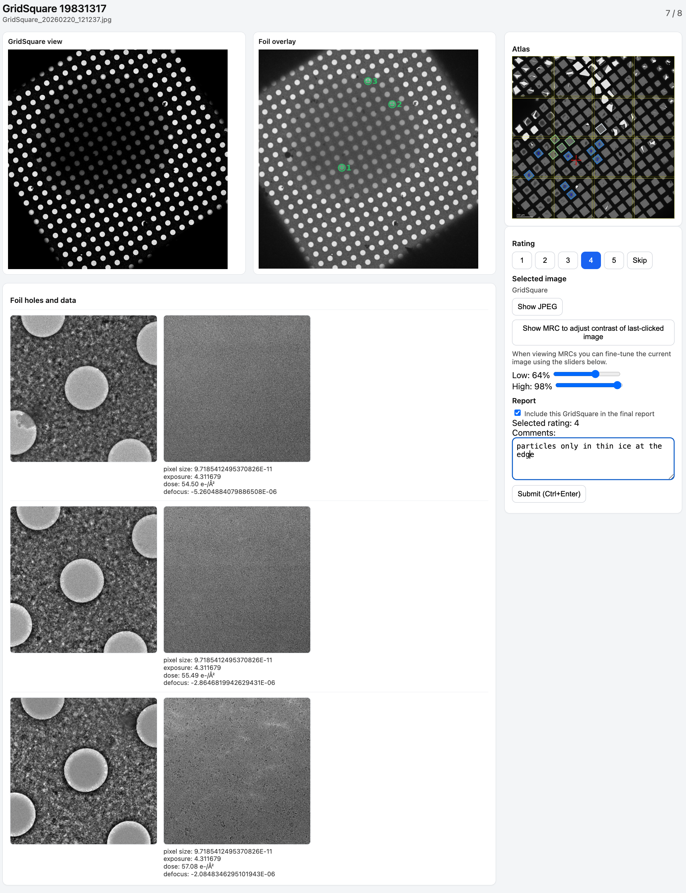

# EPU Screening Review App

The EPU Mapper web app speeds up the review of Data from Thermo Fisher EPU screening sessions so you can quickly decide which GridSquares (and FoilHoles inside them) are worth on. It renders every square, lets you add per-square rating and comments, and exports PDF summaries.

# UI overview
The screenshot shows the reviewing app. 



**Top left pannel:** 
- Shows the current Gridsquare image by default. If you click on any other image, the last-clicked image is shown there instead. You can adjust the contrast by clicking on the "Show MRC to adjust contrast..." button on the right. 

**Right panel:**
- Allows you to add comments and a rating of the square. If you click the checkbox on the right, screening images from that square will be included in a final PDF report. A minimal report showing only the user rating and comments next to the atlas will always be created.

**Bottom pannel:**
- Shows FoilHoles next to Data images

## What You Need

- Point the app at the **session root** (the directory that contains `EpuSession.dm`,
`Metadata/`, and one or more `Images-Disc*` subfolders).
- A **screenshot of the Atlas** showing the GridSquares you selected for screening: 
optional but strongly recommended so you know which gridsquare you are looking at 

<details>
<summary>Advanced path options</summary>

- The app picks the first disc automatically; override it with
  `--images-subdir Images-Disc2` or `IMAGES_SUBDIR=Images-Disc2`.
- Power users can still point directly at an `Images-Disc*` folder (or even a
  single `GridSquare_<ID>` directory) when debugging individual squares, but
  the session root keeps all metadata together and remains the recommended
  default.

</details>

To draw foil overlays, keep the session metadata next to the disc:

```
Images-Disc1/
├── GridSquare_19828383/
│   ├── GridSquare_20260220_132420.jpg
│   ├── FoilHoles/FoilHole_19919351_20260220_132420.jpg (+ .xml)
│   └── Data/FoilHole_19919351_Data_20260220_132420.jpg (+ .xml)
├── Metadata/
│   └── GridSquare_19828383.dm
├── EpuSession.dm
└── review_responses.json / PDFs   # written by the app
```

The `.dm` files inside `Metadata/` plus the top-level `EpuSession.dm` are used to plot the FoilHole positions onto the GridSquare images.
Store the atlas JPEG anywhere that is readable by the machine running the app
so the `--atlas` (or `ATLAS_JPEG`) flag can pick it up quickly.

## Windows Installer

1. Download the latest `EPUMapperReviewInstaller_<version>.exe` from the
   [Releases page](https://github.com/mvorlander/EPU_mapper/releases).
2. Double-click the installer and accept the defaults (the installer bundles
   Python, so no extra dependencies are needed).
3. Launch **EPU Mapper Review** from the Start Menu desktop shortcut, choose
   your session root (or `Images-Disc*` folder) plus an atlas JPEG, and click
   **Start review**.

Advanced packaging details for maintainers are documented separately in
`windows/README.md`.

## Run Locally (conda)

Use the provided `environment.yml` to create a reproducible Conda environment.

**Installation**

```bash
conda env create -f environment.yml          # first time only
conda activate epu-mapper
# pull in dependency updates later with: conda env update -f environment.yml
```

**Usage**

```bash
./scripts/run_review_app.sh /path/to/session_root --atlas /path/to/atlas.jpg --host 127.0.0.1 --port 8000 --open
```
<details>
If you prefer to target a specific disc directly, replace `/path/to/session_root`
with `/path/to/Images-Disc1` (or another disc) and drop `--images-subdir`. When
the session root contains multiple discs, add `--images-subdir Images-Disc2` (or
set `IMAGES_SUBDIR=Images-Disc2`) to pick one explicitly. Remove `--overlay` (or
add `--no-overlay`) if the metadata files are missing or you only want raw JPEGs.

Prefer running through `scripts/run_review_app.sh` whenever possible—it keeps
`PYTHONPATH` pointed at `src/` and mirrors the exact invocation the container
and Windows builds use.
</details>


### Troubleshooting (ports)

- If the app fails to start with “Address already in use,” the port is occupied.
  Either change the port (`./scripts/run_review_app.sh ... --port 8010`) or stop
  the other instance.
- On macOS/Linux run `lsof -i :8000` to find the owning process and terminate it
  (e.g., `kill <PID>`). On Windows run `netstat -ano | find "8000"` or use Task
  Manager to close the conflicting app.
- The Windows launcher also exposes the port field, so you can bump it to an
  unused value without leaving the GUI.

## Container Workflow (VBC only)

The Apptainer workflow used on the VBC cluster is documented in
`container/README.md`. It covers building/copying the `.sif` via
`scripts/build_and_copy_epu_mapper.sh` and running the `epu_review.sh` wrapper.
Most users outside VBC can ignore this section.

## Foil Overlay Utilities

- The main app writes `foil_overlay.png` beside each grid automatically (use
  `--no-overlay` if you prefer to disable this). If the required `Metadata/`
  or `EpuSession.dm` files are missing, overlays are skipped gracefully and a
  banner explains why.
- Overlays default to the `identity` transform (matching EPU’s orientation). In case you find the plotted positions don't match, there are options to force rotating the GridSquare image.

<details>
<summary>GridSquare rotation options</summary>

- If you know a specific rotation/flip is needed, supply
  `--overlay-transform rot90` (or `rot180`, `rot270`, `mirror_x`,
  `mirror_y`, `mirror_diag`, `mirror_diag_inv`) or use `--overlay-transform auto`
  to let the tool pick the best match on the fly.
- To debug mapping logic on a single square:

```bash
PYTHONPATH=src MPLCONFIGDIR=/tmp/mplcache FONTCONFIG_PATH=/tmp/mplcache \
  python scripts/plot_foilhole_positions.py \
    Example_data/prefloated/Images-Disc1/GridSquare_19828383 \
    --output /tmp/GridSquare_19828383_overlay.png \
    --dump-transforms /tmp/outdir
```

  That command also saves diagnostic PNGs for each tested rotation/mirror in
  `/tmp/outdir`.

</details>

## Outputs

- `Screening_overview.pdf` – one-page overview of ratings, selections, and
  atlas snapshot.
- `Screening_details.pdf` – montage pages for squares you marked for data
  collection, including foil/data thumbnails plus metadata.
- `review_responses.json` – the persisted ratings, comments, and inclusion
  flags, written next to the disc so you can resume later.

Use the web UI to download either report once you finish reviewing. The app’s
sole goal is to surface the best GridSquares/FoilHoles for downstream data
collection decisions.
