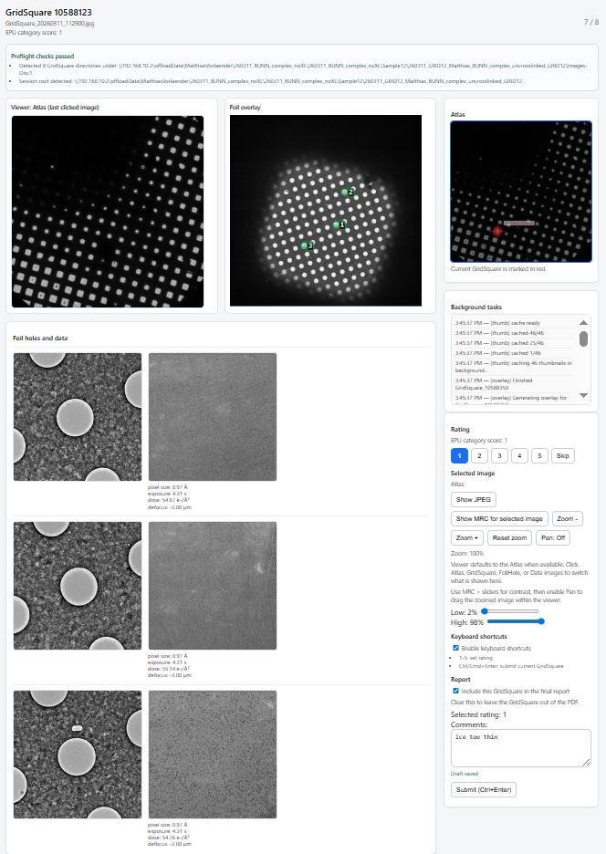

# EPU Screening Review App

The EPU Mapper web app speeds up review of Thermo Fisher EPU screening sessions so you can quickly decide which GridSquares (and FoilHoles inside them) are worth following up. It renders every square, lets you add per-square ratings/comments, and exports PDF reports.

# UI overview
The screenshot shows the main review page.



**Left side:**
- The main viewer shows the Atlas by default (when available); otherwise it starts on the current GridSquare image. Clicking any Atlas/GridSquare/FoilHole/Data image updates this viewer to the last-clicked item. When foil overlays are enabled, the current GridSquare overlay is shown next to the viewer.

**Right panel:**
- Shows the Atlas card, background-task status, rating buttons, report inclusion checkbox, comment box, and viewer controls. You can switch between JPEG/MRC here, adjust contrast, zoom within the viewer, and enable **Pan** to drag the zoomed image.

**Bottom panel:**
- Shows FoilHole thumbnails next to their Data images. Clicking any thumbnail updates the main viewer.

## What You Need

- Point the app at the **session root** (the directory that contains `EpuSession.dm`,
`Metadata/`, and one or more `Images-Disc*` subfolders).
- Atlas input (optional but strongly recommended):
  - **Preferred (new mode):** an **Atlas root directory** that contains `Atlas_*.jpg` (or `.png`) plus metadata (`.dm`; optional `.mrc` for contrast).
  - **Legacy mode:** a static atlas screenshot (`.jpg`/`.png`) without metadata-based highlighting.

## Which Paths To Provide In The GUI

Use the same path types that the launcher labels ask for:

| GUI field | What you should provide | Correct example | Do not provide |
| --- | --- | --- | --- |
| `Session root or Images-Disc folder:` | Prefer the **session root**. This is the folder that contains `EpuSession.dm`, `Metadata/`, and `Images-Disc1/` (and possibly `Images-Disc2/`, etc.). | `/data/20260220_screening/` | `Metadata/`, `Atlas/`, or an individual `GridSquare_12345/` unless you are debugging |
| `Atlas mode: Use EPU atlas data (Recommended)` and `Atlas root directory (contains Atlas_*.jpg/.dm/.mrc):` | The **Atlas folder itself**. This folder should contain `Atlas_*.jpg` or `Atlas_*.png`, plus the corresponding `.dm`; `.mrc` is optional for contrast control. | `/data/20260220_screening/Atlas/` | The individual `Atlas_123456.jpg` file in this mode |
| `Atlas mode: Use atlas screenshot with screened GridSquares` and `Atlas screenshot file (JPG/PNG):` | A single atlas image file (`.jpg` or `.png`). Use this only if you do not want metadata-based atlas mapping. | `/data/20260220_screening/Atlas/Atlas_123456.jpg` | The whole `Atlas/` folder in this mode |

The safest choice for most users is:

1. Put the **session root** into `Session root or Images-Disc folder:`
2. Leave atlas mode on **Use EPU atlas data (Recommended)**
3. Put the **Atlas folder** into `Atlas root directory (contains Atlas_*.jpg/.dm/.mrc):`

Common mistakes:

- Do not point the first field at `Metadata/` or `Atlas/`.
- In **Use EPU atlas data** mode, do not pick the atlas JPEG itself; pick the folder containing the atlas files.
- Only point directly at an `Images-Disc*` folder or a single `GridSquare_*` folder if you intentionally want a reduced/debugging scope.

<details>
<summary>Advanced path options</summary>

- The app picks the first disc automatically; override it with
  `--images-subdir Images-Disc2` or `IMAGES_SUBDIR=Images-Disc2`.
- Power users can still point directly at an `Images-Disc*` folder (or even a
  single `GridSquare_<ID>` directory) when debugging individual squares, but
  the session root keeps all metadata together and remains the recommended
  default.

</details>

To draw foil overlays, keep the session metadata next to the disc:

```
Images-Disc1/
├── GridSquare_19828383/
│   ├── GridSquare_20260220_132420.jpg
│   ├── FoilHoles/FoilHole_19919351_20260220_132420.jpg (+ .xml)
│   └── Data/FoilHole_19919351_Data_20260220_132420.jpg (+ .xml)
├── Metadata/
│   └── GridSquare_19828383.dm
├── EpuSession.dm
└── review_responses.json / PDFs   # written by the app
```

The `.dm` files inside `Metadata/` plus the top-level `EpuSession.dm` are used to plot the FoilHole positions onto the GridSquare images.
For atlas mapping, pass `--atlas` as either an atlas image path or an atlas
directory.

## Windows Installer

1. Download the latest `EPUMapperReviewInstaller_<version>.exe` from the
   [Releases page](https://github.com/mvorlander/EPU_mapper/releases).
2. Double-click the installer and accept the defaults (the installer bundles
   Python, so no extra dependencies are needed).
3. Launch **EPU Mapper Review** from the Start Menu shortcut.
4. Fill the launcher fields exactly as described in [Which Paths To Provide In The GUI](#which-paths-to-provide-in-the-gui):
   - `Session root or Images-Disc folder:` → usually the **session root**
   - `Use EPU atlas data (Recommended)` → choose the **Atlas folder**
   - `Use atlas screenshot with screened GridSquares` → choose the **atlas JPG/PNG file**
5. Click **Start review**.
   If you want the launcher to skip the browser-based review entirely, use
   **Export detailed PDF without review** instead. That button immediately
   generates the detailed PDF for all GridSquares.
6. Overlay transform is now under **Show advanced settings** (hidden by
   default in the launcher).

Advanced packaging details for maintainers are documented separately in
`windows/README.md`.

## Run Locally (conda)

Use the provided `environment.yml` to create a reproducible Conda environment.

**Installation**

```bash
conda env create -f environment.yml          # first time only
conda activate epu-mapper
# pull in dependency updates later with: conda env update -f environment.yml
```

**Usage**

```bash
./scripts/run_review_app.sh /path/to/session_root --atlas /path/to/Atlas --host 127.0.0.1 --port 8000 --open
```

This uses the same recommended inputs as the GUI: session root for the main
path, Atlas directory for `--atlas`.

<details>
If you prefer to target a specific disc directly, replace `/path/to/session_root`
with `/path/to/Images-Disc1` (or another disc) and drop `--images-subdir`. When
the session root contains multiple discs, add `--images-subdir Images-Disc2` (or
set `IMAGES_SUBDIR=Images-Disc2`) to pick one explicitly. Remove `--overlay` (or
add `--no-overlay`) if the metadata files are missing or you only want raw JPEGs.

Prefer running through `scripts/run_review_app.sh` whenever possible—it keeps
`PYTHONPATH` pointed at `src/` and mirrors the exact invocation the container
and Windows builds use.
</details>

### Optional helpers

- **Prefix PDF names** – provide a session/grid label once and reuse it for
  generated reports. Either set `SESSION_LABEL=MyRun` (or `GRID_LABEL` / `REPORT_PREFIX`)
  before launching, or pass `--grid-label MyRun` / `--session-label MyRun` to
  the wrapper/Windows launcher. The default file becomes
  `MyRun_Screening_report.pdf` (and `MyRun_Screening_details.pdf` if you use details-only export).
- **Add one session-level summary sentence** – after the final GridSquare, the
  completion page includes a text field for a single summary sentence that is
  included in generated reports.
- **Skip the UI and export everything** – add `--details-only`
  (alias: `--export-all-details`) to the command to render the detailed PDF for
  *every* GridSquare, then exit immediately. The Windows launcher exposes the
  same behavior via **Export detailed PDF without review**. Use
  `--details-output path/to/out.pdf` if you want to override the default filename.

### GridSquare Order

- GridSquares are displayed in acquisition order based on timestamps parsed from
  `GridSquare_YYYYMMDD_HHMMSS.jpg` file names (earliest first), which should
  better match EPU acquisition screenshots.
- If timestamps are missing/unparseable, the app falls back to `GridSquare_<ID>`
  numeric ordering.


### Troubleshooting (ports)

- If the app fails to start with “Address already in use,” the port is occupied.
  Either change the port (`./scripts/run_review_app.sh ... --port 8010`) or stop
  the other instance.
- On macOS/Linux run `lsof -i :8000` to find the owning process and terminate it
  (e.g., `kill <PID>`). On Windows run `netstat -ano | find "8000"` or use Task
  Manager to close the conflicting app.
- The Windows launcher also exposes the port field, so you can bump it to an
  unused value without leaving the GUI.

## Container Workflow (VBC only)

The Apptainer workflow used on the VBC cluster is documented in
`container/README.md`. It covers building/copying the `.sif` via
`scripts/build_and_copy_epu_mapper.sh` and running the `epu_review.sh` wrapper.
Most users outside VBC can ignore this section.

## Foil Overlay Utilities

- The main app writes `foil_overlay.png` beside each grid automatically (use
  `--no-overlay` if you prefer to disable this). If the required `Metadata/`
  or `EpuSession.dm` files are missing, overlays are skipped gracefully and a
  banner explains why.
- Overlays default to the `identity` transform (matching EPU’s orientation). In case you find the plotted positions don't match, there are options to force rotating the GridSquare image.

<details>
<summary>GridSquare rotation options</summary>

- If you know a specific rotation/flip is needed, supply
  `--overlay-transform rot90` (or `rot180`, `rot270`, `mirror_x`,
  `mirror_y`, `mirror_diag`, `mirror_diag_inv`) or use `--overlay-transform auto`
  to let the tool pick the best match on the fly.
- To debug mapping logic on a single square:

```bash
PYTHONPATH=src MPLCONFIGDIR=/tmp/mplcache FONTCONFIG_PATH=/tmp/mplcache \
  python scripts/plot_foilhole_positions.py \
    Example_data/prefloated/Images-Disc1/GridSquare_19828383 \
    --output /tmp/GridSquare_19828383_overlay.png \
    --dump-transforms /tmp/outdir
```

  That command also saves diagnostic PNGs for each tested rotation/mirror in
  `/tmp/outdir`.

</details>

## Atlas Marker Overlay

- When you provide an atlas path via `--atlas` (image file or atlas directory),
  the app tries to read `Atlas.dm` from the same folder and marks GridSquares
  directly on atlas views.
- `--atlas` accepts either an atlas image file or an atlas directory. If you
  pass a directory, the app auto-picks the latest matching `Atlas_*.jpg/.png`.
- If the atlas JPG is downsampled, marker coordinates are scaled automatically
  (using `Atlas_*.mrc` dimensions when present).
- The app start page now shows three atlas overview panels when atlas metadata is available:
  1) screened GridSquares overlay, 2) all squares with EPU category overlay, and 3) raw atlas (no overlay).
- Category overlays use semi-transparent markers (50% opacity).
- **Important:** EPU category colors are currently arbitrary and do **not** match the EPU GUI color code.
- Current category palette in this app: `0 = turquoise`, `1 = orange`, `2 = blue`, `3 = yellow`, `4 = pink`.
- If no atlas metadata is found, the app falls back to plain atlas images.
  Use `--no-atlas-overlay` to disable atlas marker overlays.
- In the Windows launcher, this behavior maps to:
  - **Use EPU atlas data** → metadata-based atlas overlays in UI/PDF
  - **Use atlas screenshot with screened GridSquares** → static atlas mode
- The atlas panel is clickable: selecting it enables `Show MRC` (if
  `Atlas_*.mrc` is present), the same contrast sliders, and zoom controls
  (`Zoom -`, `Zoom +`, `Reset zoom`) used for the main image viewer.

## Outputs

- `Screening_report.pdf` – combined PDF with overview on page 1, followed by
  detailed pages for included GridSquares.
- `Screening_details.pdf` – optional details-only export (e.g. via
  `--details-only` / `--export-all-details`), including foil/data thumbnails plus metadata.
- `review_responses.json` – the persisted ratings, comments, and inclusion
  flags, written next to the disc so you can resume later.
- `review_summary.txt` – optional one-line session summary entered on the final
  page before downloading reports.

Use the web UI to download the combined report once you finish reviewing.

## Acknowledgements

- Max Wilkinson (`wilkinm@mskcc.org`) shared code that helped with mapping
  FoilHole positions onto GridSquare images.
