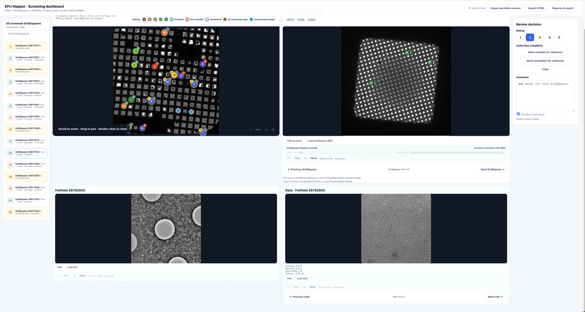
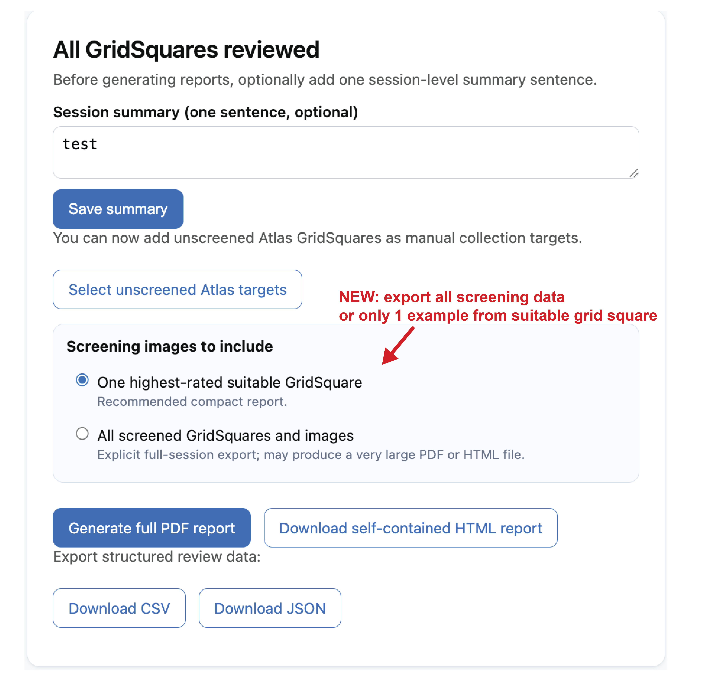
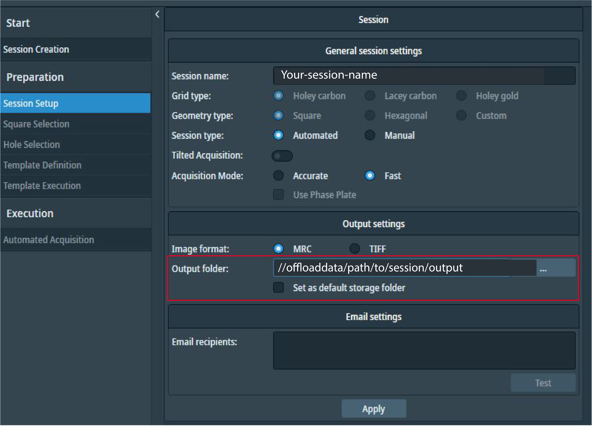
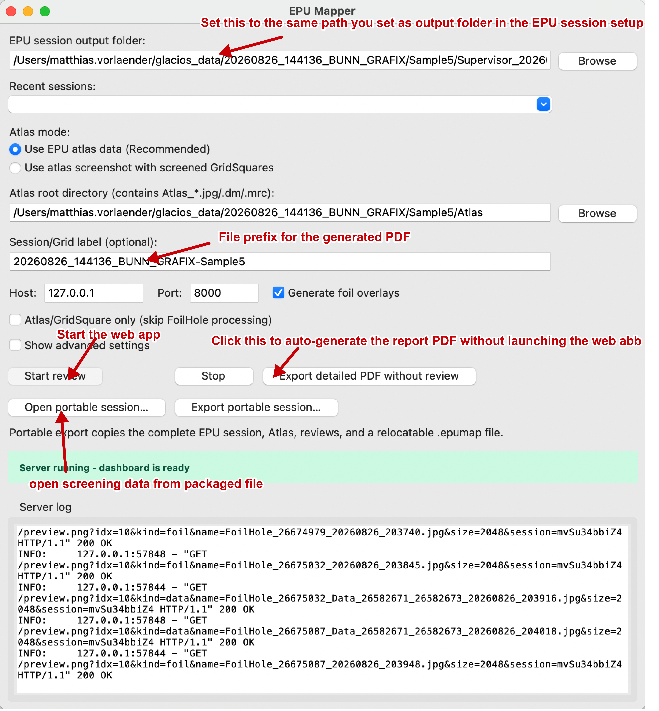

# EPU Screening Review App

The EPU Mapper web app speeds up review of Thermo Fisher EPU screening sessions so you can quickly decide which GridSquares (and FoilHoles inside them) are worth following up. It renders every square, lets you add per-square ratings/comments, and exports PDF or self-contained HTML reports.

## Recent changes

### [v0.5.1](https://github.com/mvorlander/EPU_mapper/releases/tag/v0.5.1) — Flexible reports

- **Report scope:** Choose one highest-rated suitable GridSquare or all screened
  GridSquares with their available images.
- **Export formats:** Generate either report as a **PDF** or portable,
  self-contained **HTML** file.

### [v0.3–v0.5](https://github.com/mvorlander/EPU_mapper/releases/tag/v0.5.0) — Dashboard redesign

- **Unified dashboard:** Linked the **Atlas, GridSquare, FoilHole, and Data**
  viewers with hover previews and Previous/Next navigation.
- **Faster image review:** Added **PNG-first previews** with on-demand **MRC**
  loading, contrast adjustment, zoom, and pan.
- **Review and targeting:** Added persistent ratings, comments, suitability
  decisions, live Atlas annotations, and manual unscreened targets.
- **Portable and reliable:** Added portable sessions, session-safe image
  matching, and more dependable **macOS and Windows launchers**.

## Why use it

- Inspect GridSquare, FoilHole, and Data images in one page.
- Use the atlas-first dashboard to jump directly to any screened GridSquare and
  browse all of its associated images without leaving the overview.
- Hover screened atlas squares for a large GridSquare preview. Click a square
  to open only the GridSquare foil-overlay view. Hover a screened FoilHole to
  show its matched Data image beside the GridSquare and its FoilHole image
  underneath.
- Map the acquired FoilHoles onto the GridSquare and the current GridSquare
  position on the atlas to pick the best areas.
- Load fast PNG previews by default, request an MRC only for the particular
  atlas, GridSquare, FoilHole, or Data image that needs closer inspection, and
  adjust contrast, zoom, or pan continuously (scroll to zoom, then drag—no
  separate pan tool) once the MRC is loaded.
- Spot GridSquares without screening Data immediately: their atlas markers and
  acquisition-list cards carry an amber warning state.
- Rate each GridSquare, add reviewer comments, mark it suitable or unsuitable
  for collection, and choose whether it stays in the final report.




### Export reports to guide data collection

EPU Mapper generates PDF or self-contained HTML reports with Atlas overviews,
ratings, collection-suitability annotations, comments, and the requested
GridSquare/FoilHole/Data imagery. These reports provide a portable record for
choosing targets and setting up high-resolution data collection.

**New**: To avoid oversized PDFs, you can now choose between exporting one
representative GridSquare marked as suitable for collection, with its screening
images, or all screened GridSquares and images.



## Installation

### Lightweight macOS launcher

After creating the Conda environment below, build a small native launcher and
install it into your user Applications folder:

```bash
./scripts/build_macos_launcher.sh --install
```

Open **EPU Mapper** from Finder or Spotlight. The launcher remembers recent
sessions and their atlas locations, reopens browse dialogs at the last-used
input location, starts the local dashboard, and provides a Stop
button plus access to details-only PDF export. A browser preparation page opens
immediately and redirects to the dashboard when session scanning is complete.
If the server fails during launch, the waiting page and launcher both show a
prominent red error. The launcher dialog includes the final server messages and
the path to the persistent log.
Keep the launcher open while using the dashboard; its **Stop server** button or
quitting the launcher stops the local site. Server output is also retained at
`~/Library/Logs/EPUMapper/server.log` for troubleshooting.
The app reuses the local Conda environment rather than bundling a second Python runtime. See
[`macos/README.md`](macos/README.md) for selecting a specific Python environment.

### Windows installer

1. Download the latest `EPUMapperReviewInstaller_<version>.exe` from the
   [Releases page](https://github.com/mvorlander/EPU_mapper/releases).
2. Double-click the installer and accept the defaults (the installer bundles
   Python, so no extra dependencies are needed).
3. Launch **EPU Mapper Review** from the Start Menu shortcut.


### Install in conda env (for macOS or Linux)

Use the provided `environment.yml` to create a reproducible Conda environment.

**Installation**

```bash
conda env create -f environment.yml          # first time only
conda activate epu-mapper
# pull in dependency updates later with: conda env update -f environment.yml
```

**Usage**

```bash
./scripts/run_review_app.sh //offloaddata/path/to/session/output --atlas /path/to/Atlas --host 127.0.0.1 --port 8000 --open
```

This uses the same recommended inputs as the GUI: the EPU session output folder
for the main path, and the Atlas directory for `--atlas`.


## Step-by-step walkthrough

### 1. Find the EPU output folder



Use the same folder shown as `Output folder` in the EPU session setup. This is the path you should paste into the app as the `EPU session output folder`, and it should contain one or more `Images-Disc*` folders with a structure like this:

```
Images-Disc1/
├── GridSquare_19828383/
│   ├── GridSquare_20260220_132420.jpg
│   ├── FoilHoles/FoilHole_19919351_20260220_132420.jpg (+ .xml)
│   └── Data/FoilHole_19919351_Data_20260220_132420.jpg (+ .xml)
├── Metadata/
│   └── GridSquare_19828383.dm
├── EpuSession.dm
└── review_responses.json / PDFs   # written by the app
```


### 2. Start the launcher and fill the launcher fields



- `EPU session output folder:` use the EPU `Output folder` path shown above.
- `Use EPU atlas data (Recommended):` point this to the `Atlas/` folder that EPU created when generating the atlases.
- `Session/Grid label (optional):` adds a prefix to the exported PDF filenames.
- `Start review:` launches the web app.
- `Atlas/GridSquare only (skip FoilHole processing):` loads just the atlas and
  GridSquare mapping, which is much faster for sessions with very large numbers
  of FoilHoles.
- `Export detailed PDF without review:` skips the interactive UI and generates a
  detailed PDF for all GridSquares immediately.
- `Export portable session…:` copies the complete EPU session, Atlas, review
  annotations, and manual targets into a self-contained folder. Its
  `EPUMapperSession.epumap` manifest contains only relative paths.
- `Open portable session…:` loads an `.epumap` manifest and resolves the copied
  session and Atlas relative to its new folder, so the bundle can be moved to
  another disk or computer.

### 3. Use the screening dashboard

The dashboard shown above runs preflight checks,
confirms that the session folders were found, and loads PNG previews by default.
Hover a numbered screened-square marker to preview its GridSquare, then click it
to open the linked workspace. The screened GridSquare list remains in a compact
left rail, Atlas/GridSquare and FoilHole/Data form the central 2x2 image area,
and rating, suitability, report inclusion, and comments remain visible in a
right review rail. The first matched FoilHole/Data pair appears automatically; hover or
click another numbered hole, or use **Previous hole** / **Next hole** below the
Data viewer, to update both lower viewers. Press
Command+Enter on macOS (or Ctrl+Enter elsewhere) to save and advance to the
next GridSquare.

Use **Previous GridSquare** / **Next GridSquare** directly under the GridSquare
viewer to step through the acquisition order. That viewer also exposes its
**Load GridSquare MRC**, zoom/pan, reset, and MRC contrast controls. The
dashboard's **Export portable session** button copies the full session to a
destination folder while showing background progress; the same export remains
available from the desktop launcher.

Every viewer loads a PNG by default, supports scroll-to-zoom and drag-to-pan,
and offers MRC loading plus contrast controls when an MRC exists. Atlas markers
update live: fill color represents rating, while a green, red, or gray outline
and S/U/- badge represents collection suitability. The legend is outside the
Atlas image so it never hides image data.

After screening, choose **Add unscreened targets** in the Atlas header (or use
the shortcut on the review-complete page) and click unscreened Atlas squares to
add/remove them as manual collection targets. These choices persist in
`manual_collection_targets.json` and are included in JSON, PDF, and embedded
HTML reports as cyan diamond markers.

### 4. Review GridSquares in the web app

Use the annotated screenshot in the `Why use it` section as the reference for the main interactive workflow. This is where you inspect images, adjust MRC  contrast, rate each GridSquare, and add reviewer comments.

### 5. Export the detailed pages

Export a PDF or self-contained HTML report after review. Reports show the
selected GridSquare in context with its Atlas location, GridSquare image, and
matched FoilHole/Data imagery. In `Atlas/GridSquare only` mode, FoilHole
sections are omitted entirely.

## Additional info
- **Prefix PDF names** – provide a session/grid label once and reuse it for
  generated reports. Either set `SESSION_LABEL=MyRun` (or `GRID_LABEL` / `REPORT_PREFIX`)
  before launching, or pass `--grid-label MyRun` / `--session-label MyRun` to
  the wrapper/Windows launcher. The default file becomes
  `MyRun_Screening_report.pdf` (and `MyRun_Screening_details.pdf` if you use details-only export).
- **Add one session-level summary sentence** – after the final GridSquare, the
  completion page includes a text field for a single summary sentence that is
  included in generated reports.
- **Skip the UI and export everything** – add `--details-only`
  (alias: `--export-all-details`) to the command to render the detailed PDF for
  *every* GridSquare, then exit immediately. The Windows launcher exposes the
  same behavior via **Export detailed PDF without review**. Use
  `--details-output path/to/out.pdf` if you want to override the default filename.
- **Atlas/GridSquare-only mode** – add `--skip-foil-processing` if you only
  want to see which GridSquares were collected on the atlas and do not need
  FoilHole/data discovery.

### GridSquare Order

- GridSquares are displayed in acquisition order based on timestamps parsed from
  `GridSquare_YYYYMMDD_HHMMSS.jpg` file names (earliest first), which should
  better match EPU acquisition screenshots.
- If timestamps are missing/unparseable, the app falls back to `GridSquare_<ID>`
  numeric ordering.


### Troubleshooting (ports)

- If the app fails to start with “Address already in use,” the port is occupied.
  Either change the port (`./scripts/run_review_app.sh ... --port 8010`) or stop
  the other instance.
- On macOS/Linux run `lsof -i :8000` to find the owning process and terminate it
  (e.g., `kill <PID>`). On Windows run `netstat -ano | find "8000"` or use Task
  Manager to close the conflicting app.
- The Windows launcher also exposes the port field, so you can bump it to an
  unused value without leaving the GUI.

## Container Workflow (VBC only)

The Apptainer workflow used on the VBC cluster is documented in
`container/README.md`. It covers building/copying the `.sif` via
`scripts/build_and_copy_epu_mapper.sh` and running the `epu_review.sh` wrapper.
Most users outside VBC can ignore this section.


## Outputs

- `Screening_report.pdf` – combined PDF with large screened, EPU-category, and
  raw Atlas views on page 1. The marker legend is a separate panel and never
  covers an Atlas image.
  Screened positions use their rating color as the marker fill and their
  collection status as a green suitable, red unsuitable, or gray unmarked
  outline/badge. The report then shows screening data for exactly one included
  GridSquare marked suitable for collection, choosing the highest rating and
  then acquisition order when ratings tie. On **Reports & export**, explicitly
  choose **All screened GridSquares and images** to instead create
  `Screening_report_all_screened.pdf` with every screened GridSquare and all of
  its available FoilHole/Data pairs. This can be a very large file.
- `Screening_report.html` – self-contained HTML version of the combined report.
  All displayed images are embedded in the file, so it can be copied and opened
  without the EPU Mapper server or its source data paths. The same report-scope
  choice creates `Screening_report_all_screened.html` when all screened imagery
  is requested.
- `Screening_details.pdf` – optional details-only export (e.g. via
  `--details-only` / `--export-all-details`), including all included
  GridSquares with foil/data thumbnails plus metadata.
- `review_responses.json` – the persisted ratings, comments, inclusion flags,
  and suitable/unsuitable collection decisions, written next to the disc so
  you can resume later.
- `manual_collection_targets.json` – manually selected unscreened Atlas
  GridSquares to target during collection.
- `review_summary.txt` – optional one-line session summary entered on the final
  page before downloading reports.

Use the web UI to download the combined report once you finish reviewing.

## License

EPU Mapper is released under the [MIT License](LICENSE). You may use, copy,
modify, distribute, sublicense, and sell it for academic, commercial, or other
purposes, subject to the license terms.

## Acknowledgements

- Max Wilkinson (`wilkinm@mskcc.org`) shared code that helped with mapping
  FoilHole positions onto GridSquare images.
