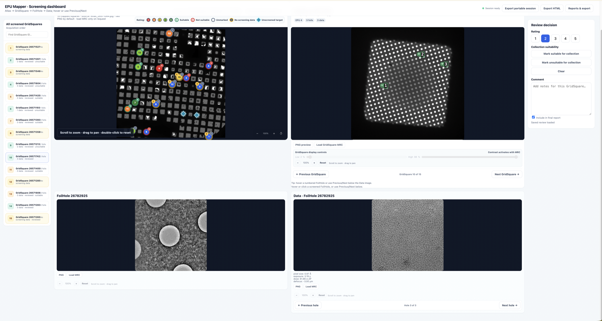
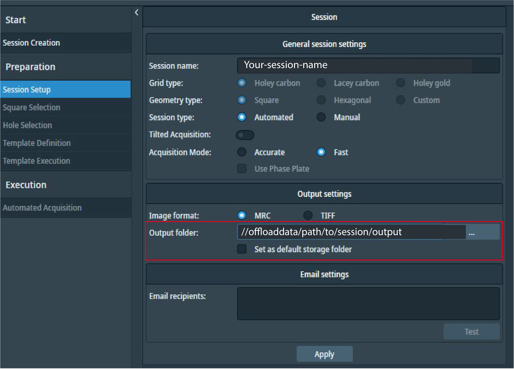
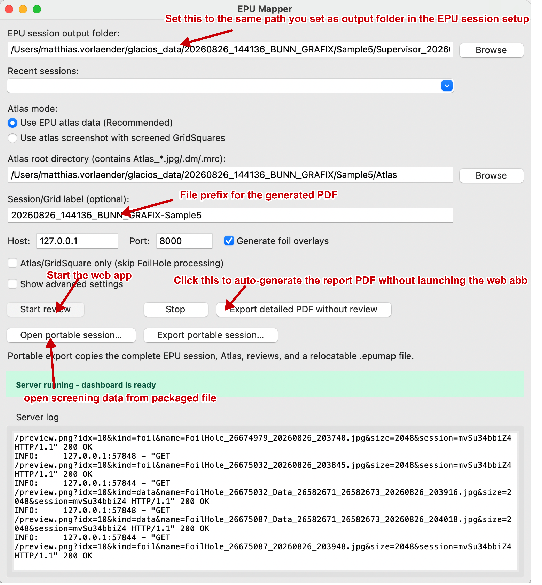

# EPU Screening Review App

The EPU Mapper web app speeds up review of Thermo Fisher EPU screening sessions so you can quickly decide which GridSquares (and FoilHoles inside them) are worth following up. It renders every square, lets you add per-square ratings/comments, and exports PDF or self-contained HTML reports.

## Recent changes

### v0.7.0 — Acquisition browsing, particle density and targeting checks

- **Acquisition mode:** browse many JPEG/PNG exposures per FoilHole, with separate square, hole, and exposure navigation.
- **FoilHole-only mode:** map and inspect holes without scanning Data directories.
- **Automatic overlays:** use FoilHole XML positions when the session's DM metadata is missing or still copying; refresh to add newly arrived holes.
- **Beam-shift groups:** solid centering-hole outlines and matching-color dashed neighbors, with adjustable circle radius/fill and optional clickable planned Data footprints from EPU metadata.
- **Stable acquisition selection:** click instead of hover, zoom to the selected hole, clearer Data footprints, and explicit explanations for beam-shifted targets without their own FoilHole preview.
- **Network-friendly loading:** background indexing, local caching and annotations, explicit refresh, and optional Atlas/GridSquare MRC loading.
- **Optional CryoSPARC density:** gradient fills independent of acquisition-group outlines, per-square particle counts, and a collapsible import panel with Clear.
- **Clearer atlas handling:** availability/suitability legends and refreshed atlas metadata when reopening a cached session. Missing count fields are never displayed as zero.
- **Visible processing:** dashboard and viewer activity indicators distinguish indexing, image loading, queued mapping, and particle import, with elapsed time for slow reads.
- **Linked selection:** the displayed hole/exposure synchronizes to a white, outline-only GridSquare highlight; density colors remain independent and stale previews clear during navigation.
- **Targeting checks:** mark observed FoilHole positions in a separate arrow layer, compare per-square shifts, and export the original/observed coordinates as JSON without modifying EPU metadata.

### [v0.6.0](https://github.com/mvorlander/EPU_mapper/releases/tag/v0.6.0) — Collection plans and image tools

- **Portable results:** Interactive JPEG-only HTML plans (no MRCs), PDF checklists,
  and independent full-session exports that preserve originals and annotations.
- **Image tools:** Enlarge, auto-contrast, black/white levels, gamma, optional
  low-pass filtering, and a persistent highlight for the displayed FoilHole.
- **Faster review:** Prioritized shortlists, preferred exposures, hover previews,
  filters, undo, and keyboard navigation.
- **Safer data:** Recoverable review drafts, visible save failures, and improved
  acquisition-aware FoilHole/Data and MRC matching.
- **Reliable launch:** Automatic free-port selection and browser readiness checks
  tied to the newly started session.

### [v0.5.1](https://github.com/mvorlander/EPU_mapper/releases/tag/v0.5.1) — Flexible reports

- **Report scope:** Choose one highest-rated suitable GridSquare or all screened
  GridSquares with their available images.
- **Export formats:** Generate either report as a **PDF** or portable,
  self-contained **HTML** file.

### [v0.3–v0.5](https://github.com/mvorlander/EPU_mapper/releases/tag/v0.5.0) — Dashboard redesign

- **Unified dashboard:** Linked the **Atlas, GridSquare, FoilHole, and Data**
  viewers with hover previews and Previous/Next navigation.
- **Faster image review:** Added **PNG-first previews** with on-demand **MRC**
  loading, contrast adjustment, zoom, and pan.
- **Review and targeting:** Added persistent ratings, comments, suitability
  decisions, live Atlas annotations, and manual unscreened targets.
- **Portable and reliable:** Added portable sessions, session-safe image
  matching, and more dependable **macOS and Windows launchers**.

## CryoSPARC particle density

### Observed targeting shifts

In Acquisition or FoilHole-only mode, select a hole with its own FoilHole preview.
Open **Observed targeting shifts** under the GridSquare, click **Mark observed
position**, then click the actual hole centre on the GridSquare. Scroll to zoom;
Esc cancels. The separate toggleable layer draws **EPU → observed** arrows without
moving the original markers, acquisition footprints, or particle densities.
Mark again to replace the correction for that preview, or remove it with
**Remove selected correction**. Observations save locally and are included in
annotation JSON; **Export observed shifts** exports just these measurements.
The per-square summary uses normalized image coordinates (right/down positive),
not stage coordinates. It describes only manually marked cases, not an unbiased
test of whether errors are random/systematic. Arrows are not yet in HTML/PDF reports.

### Importing particle subsets

In the normal launcher select **Acquisition (multiple exposures per hole)**, choose
the session and atlas, then open **CryoSPARC particle density · optional** in the
dashboard. Import your particle `.cs` file and its matching passthrough `.cs` if
requested. **Clear density** restores ordinary acquisition overlays.

The particle table needs `uid`, `location/micrograph_path`,
`location/center_x_frac`, and `location/center_y_frac`, either itself or split
between the main and UID-matched passthrough table. For J53, use both
`particles_selected.cs` and `J53_passthrough_particles_selected.cs`. No CryoSPARC
server, particle stacks, class averages, `job.json`, or Data MRCs are needed.
EPU previews and XML/DM metadata are still required to map particles onto
GridSquares and calculate physical density from planned acquisition footprints.

Counts describe the imported subset, not all particles in the acquisition. The
color scale is linear and relative within each square. Density is held in memory
until the server stops and is not yet included in portable reports/session bundles.
After new files finish copying, use **Refresh index**, wait for completion, then
reimport the particle files. When upgrading, restart the server first;
reloading the browser alone does not update its backend.

**Atlas colors:** teal/green fill = Data previews indexed; orange fill = no Data
previews indexed (possibly incomplete copying or a stale index). Green/red rings
mean suitable/unsuitable. These are separate from particle-density colors.

## Why use it

- Inspect GridSquare, FoilHole, and Data images in one page.
- Use the atlas-first dashboard to jump directly to any screened GridSquare and
  browse all of its associated images without leaving the overview.
- Hover screened atlas squares for a large GridSquare preview. Click a square
  to open its foil-overlay view beside the Atlas. Hover a screened FoilHole to
  update the linked FoilHole and Data viewers below.
- Map the acquired FoilHoles onto the GridSquare and the current GridSquare
  position on the atlas to pick the best areas.
- Load fast PNG previews by default, request an MRC only for the particular
  atlas, GridSquare, FoilHole, or Data image that needs closer inspection, and
  enlarge, adjust contrast, zoom, or pan continuously (scroll to zoom, then
  drag—no separate pan tool). These controls work for PNG and MRC previews.
- Spot GridSquares without screening Data immediately: their atlas markers and
  acquisition-list cards carry an amber warning state.
- Rate each GridSquare, add reviewer comments, mark it suitable or unsuitable
  for collection, and choose whether it stays in the final report.




### Export reports to guide data collection

EPU Mapper generates PDF or self-contained HTML reports with Atlas overviews,
ratings, collection-suitability annotations, comments, and the requested
GridSquare/FoilHole/Data imagery. These reports provide a portable record for
choosing targets and setting up high-resolution data collection.

Use **Export collection plan** in the dashboard. Choose **Interactive HTML** or
**PDF**, then choose the screening detail
scope: one representative suitable square, all included collection targets, or
all screening images (including repeat exposures and unmatched Data images).
The dialog shows the number of source previews before export. Annotations for
all squares remain available even when the image scope is restricted.

Double-click the HTML file to open the read-only plan in a modern browser:
no server, EPU Mapper installation, or Internet connection is needed. Full
session bundles are exported separately with **Export full session** and include
`EPUMapperSession.epumap` for resuming edits in the launcher. Neither export waits
for or automatically generates the other. The original MRCs
remain in the full bundle; the lightweight HTML embeds JPEG previews only
(quality 90, up to 1800 px for screening images and 3000 px for the raw Atlas).

### Review to collection

Mark a square **suitable**, assign **Primary**, **Backup**, or **Needs screening**,
and reorder it in the collection shortlist. Click a hole to pin its exposure
for the report; **Enable hover previews** resumes browsing without losing that
preference. Manual Atlas targets are explicitly labelled as needing screening.

Use **1–5** for rating, **S/X** for suitable/unsuitable, **←/→** for holes,
**[/]** for squares, and **N** for the next unreviewed square. While writing a
comment, **Cmd/Ctrl + Enter** saves and advances. **Undo last saved edit** restores
the previous review values for the selected square. Failed saves block
navigation/export and can be retried by clicking the save-status message.

Developer checks: `python -m unittest discover -s tests -v` in the application
environment. No GitHub publication is required to build/install local changes.

## Installation

### Lightweight macOS launcher

The launcher now has a **Review mode** selector. Choose **Acquisition** for multi-exposure collections or **FoilHole only** to ignore Data images. Screening retains the existing report/export workflow. See [acquisition input requirements](docs/acquisition-input-data.md) for the folders to request from your facility.

After creating the Conda environment below, build a small native launcher and
install it into your user Applications folder:

```bash
./scripts/build_macos_launcher.sh --install
```

Open **EPU Mapper** from Finder or Spotlight. The launcher remembers recent
sessions and their atlas locations, reopens browse dialogs at the last-used
input location, starts the local dashboard, and provides a Stop
button plus access to details-only PDF export. A browser preparation page opens
immediately and redirects to the dashboard when session scanning is complete.
If the server fails during launch, the waiting page and launcher both show a
prominent red error. The launcher dialog includes the final server messages and
the path to the persistent log.
Keep the launcher open while using the dashboard; its **Stop server** button or
quitting the launcher stops the local site. Server output is also retained at
`~/Library/Logs/EPUMapper/server.log` for troubleshooting.
The app reuses the local Conda environment rather than bundling a second Python runtime. See
[`macos/README.md`](macos/README.md) for selecting a specific Python environment.

### Windows portable app

1. Download the latest `EPUMapperReview_portable_<version>.zip` from the
   [Releases page](https://github.com/mvorlander/EPU_mapper/releases).
2. Extract the complete ZIP to a local folder; keep its bundled files together.
3. Run `EPUMapperReview.exe`. Python and dependencies are bundled; no separate
   installation is needed.


### Install in conda env (for macOS or Linux)

Use the provided `environment.yml` to create a reproducible Conda environment.

**Installation**

```bash
conda env create -f environment.yml          # first time only
conda activate epu-mapper
# pull in dependency updates later with: conda env update -f environment.yml
```

**Usage**

```bash
./scripts/run_review_app.sh //offloaddata/path/to/session/output --atlas /path/to/Atlas --host 127.0.0.1 --port 8000 --open
```

This uses the same recommended inputs as the GUI: the EPU session output folder
for the main path, and the Atlas directory for `--atlas`.


## Step-by-step walkthrough

### 1. Find the EPU output folder



Use the same folder shown as `Output folder` in the EPU session setup. This is the path you should paste into the app as the `EPU session output folder`, and it should contain one or more `Images-Disc*` folders with a structure like this:

```
Images-Disc1/
├── GridSquare_19828383/
│   ├── GridSquare_20260220_132420.jpg
│   ├── FoilHoles/FoilHole_19919351_20260220_132420.jpg (+ .xml)
│   └── Data/FoilHole_19919351_Data_20260220_132420.jpg (+ .xml)
├── Metadata/
│   └── GridSquare_19828383.dm
├── EpuSession.dm
└── review_responses.json / PDFs   # written by the app
```


### 2. Start the launcher and fill the launcher fields



- `EPU session output folder:` use the EPU `Output folder` path shown above.
- `Use EPU atlas data (Recommended):` point this to the `Atlas/` folder that EPU created when generating the atlases.
- `Session/Grid label (optional):` adds a prefix to the exported PDF filenames.
- `Start review:` launches the web app.
- `Atlas/GridSquare only (skip FoilHole processing):` loads just the atlas and
  GridSquare mapping, which is much faster for sessions with very large numbers
  of FoilHoles.
- `Export detailed PDF without review:` skips the interactive UI and generates a
  detailed PDF for all GridSquares immediately.
- `Export portable session…:` copies the complete EPU session, Atlas, review
  annotations, and manual targets into a self-contained folder. Its
  `EPUMapperSession.epumap` manifest contains only relative paths.
- `Open portable session…:` loads an `.epumap` manifest and resolves the copied
  session and Atlas relative to its new folder, so the bundle can be moved to
  another disk or computer.

### 3. Use the screening dashboard

The dashboard shown above runs preflight checks,
confirms that the session folders were found, and loads PNG previews by default.
Hover a numbered screened-square marker to preview its GridSquare, then click it
to open the linked workspace. The screened GridSquare list remains in a compact
left rail, Atlas/GridSquare and FoilHole/Data form the central 2x2 image area,
and rating, suitability, report inclusion, and comments remain visible in a
right review rail. The first matched FoilHole/Data pair appears automatically; hover or
click another numbered hole, or use **Previous hole** / **Next hole** below the
Data viewer, to update both lower viewers. Press
Command+Enter on macOS (or Ctrl+Enter elsewhere) to save and advance to the
next GridSquare.

Use **Previous GridSquare** / **Next GridSquare** directly under the GridSquare
viewer to step through the acquisition order. Each viewer has **Enlarge** and
**Adjust image** controls below it: auto-contrast, black/white percentiles,
gamma, and optional Gaussian low-pass filtering. Changes affect display only,
not originals or exports. Close the enlarged view with its button or Escape.
The dashboard's **Export full session** button copies the full session to a
destination folder while showing background progress; the same export remains
available from the desktop launcher.

Every viewer loads a PNG by default, supports scroll-to-zoom and drag-to-pan,
and offers MRC loading when a matching MRC exists. The displayed FoilHole is
highlighted with a cyan ring on the GridSquare. Atlas markers update live;
choose **Collection status colors** or **Rating colors** to control their fill.
The S/U/- badges indicate suitability. The legend stays outside the Atlas image.

After screening, choose **Add unscreened targets** in the Atlas header (or use
the shortcut on the review-complete page) and click unscreened Atlas squares to
add/remove them as manual collection targets. These choices persist in
`manual_collection_targets.json` and are included in JSON, PDF, and embedded
HTML reports as cyan diamond markers.

### 4. Review GridSquares in the web app

Use the dashboard to inspect images, adjust preview contrast, rate each
GridSquare, add comments, and select collection targets.

### 5. Export the detailed pages

Export a PDF or self-contained HTML report after review. Reports show the
selected GridSquare in context with its Atlas location, GridSquare image, and
matched FoilHole/Data imagery. In `Atlas/GridSquare only` mode, FoilHole
sections are omitted entirely.

## Additional info

- **Prefix PDF names** – provide a session/grid label once and reuse it for
  generated reports. Either set `SESSION_LABEL=MyRun` (or `GRID_LABEL` / `REPORT_PREFIX`)
  before launching, or pass `--grid-label MyRun` / `--session-label MyRun` to
  the wrapper/Windows launcher. The default file becomes
  `MyRun_Screening_report.pdf` (and `MyRun_Screening_details.pdf` if you use details-only export).
- **Add collection instructions** – enter a session summary in the
  **Export collection plan** dialog to include it in generated reports.
- **Skip the UI and export everything** – add `--details-only`
  (alias: `--export-all-details`) to the command to render the detailed PDF for
  *every* GridSquare, then exit immediately. The Windows launcher exposes the
  same behavior via **Export detailed PDF without review**. Use
  `--details-output path/to/out.pdf` if you want to override the default filename.
- **Atlas/GridSquare-only mode** – add `--skip-foil-processing` if you only
  want to see which GridSquares were collected on the atlas and do not need
  FoilHole/data discovery.

### GridSquare Order

- GridSquares are displayed in acquisition order based on timestamps parsed from
  `GridSquare_YYYYMMDD_HHMMSS.jpg` file names (earliest first), which should
  better match EPU acquisition screenshots.
- If timestamps are missing/unparseable, the app falls back to `GridSquare_<ID>`
  numeric ordering.


### Troubleshooting (ports)

- The launcher automatically selects a free port if the preferred port is busy,
  leaving the existing application running. Use the dashboard it opens, not an
  old browser tab: the new address may differ from `127.0.0.1:8000`.
- For command-line launches, pass **`--auto-port`** for the same fallback, or
  choose a specific port with `--port 8010`. A fixed-port collision fails before
  session images are loaded.

## Container Workflow (VBC only)

The Apptainer workflow used on the VBC cluster is documented in
`container/README.md`. It covers building/copying the `.sif` via
`scripts/build_and_copy_epu_mapper.sh` and running the `epu_review.sh` wrapper.
Most users outside VBC can ignore this section.


## Outputs

- `Screening_report.pdf` – combined PDF with large screened, EPU-category, and
  raw Atlas views on page 1. The marker legend is a separate panel and never
  covers an Atlas image.
  Screened positions use their rating color as the marker fill and their
  collection status as a green suitable, red unsuitable, or gray unmarked
  outline/badge. In **Export collection plan**, choose one highest-rated suitable
  square, all included collection targets, or **All screening images**. The
  all-images scope creates
  `Screening_report_all_screened.pdf` with every screened GridSquare and all of
  its available FoilHole/Data pairs. This can be a very large file.
- `Screening_report.html` – interactive, self-contained collection plan with
  JPEG previews, clickable Atlas positions, and a searchable shortlist. It opens
  without a server, original data, or specialized software. The same report-scope
  choice creates `Screening_report_all_screened.html` when all screened imagery
  is requested.
- `Screening_details.pdf` – optional details-only export (e.g. via
  `--details-only` / `--export-all-details`), including all included
  GridSquares with foil/data thumbnails plus metadata.
- `review_responses.json` – the persisted ratings, comments, inclusion flags,
  and suitable/unsuitable collection decisions, written next to the disc so
  you can resume later.
- `manual_collection_targets.json` – manually selected unscreened Atlas
  GridSquares to target during collection.
- `review_summary.txt` – collection instructions/session summary from the export dialog.
- `EPUMapperSession.epumap` – manifest in the separately exported full-session
  folder, alongside copied originals and annotations. No HTML is generated by
  this export. Background report downloads may have a unique job-ID prefix.

Use the web UI to download the combined report once you finish reviewing.

## License

EPU Mapper is released under the [MIT License](LICENSE). You may use, copy,
modify, distribute, sublicense, and sell it for academic, commercial, or other
purposes, subject to the license terms.

## Acknowledgements

- Max Wilkinson (`wilkinm@mskcc.org`) shared code that helped with mapping
  FoilHole positions onto GridSquare images.
